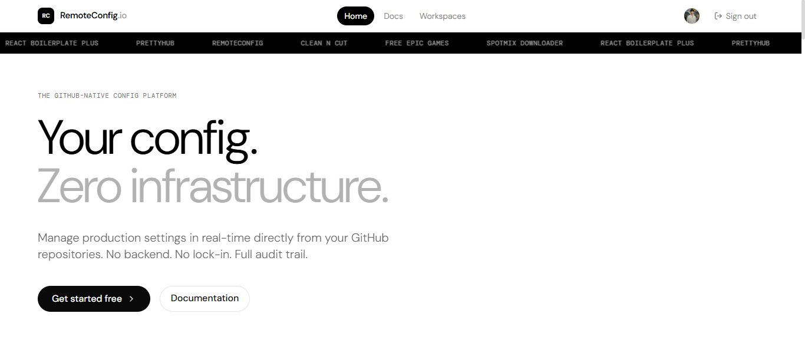

<div align="center">


# Serverless Dashboard
</div>

*A modern, lightweight dashboard for managing and monitoring your serverless applications.*

<p>
  <a href="https://thinakaranmanokaran.github.io/serverless_dashboard/"><strong>🌐 Live Demo</strong></a>
</p>

<div align="center">

</div>

---

## ✨ Features

* ⚡ Fast and lightweight
* 🎨 Modern responsive UI
* 📊 Beautiful dashboard interface
* 🔍 SEO optimized
* ♿ Accessible design
* 📱 Mobile friendly
* 🚀 Built with modern web technologies
* 🌙 Clean developer experience

---

## 🚀 Live Demo

Visit the application:

**https://thinakaranmanokaran.github.io/serverless_dashboard/**

---

## 🛠️ Tech Stack

* React
* TypeScript
* Vite
* Tailwind CSS
* shadcn/ui

---

## 📦 Installation

```bash
git clone https://github.com/thinakaranmanokaran/serverless-dashboard.git

cd serverless-dashboard

npm install

npm run dev
```

---

## 🏗️ Build

```bash
npm run build
```

---

## 📁 Project Structure

```
src/
├── components/
├── layouts/
├── pages/
├── hooks/
├── lib/
└── assets/

public/
├── favicon*.png
├── preview.png
├── robots.txt
└── sitemap.xml
```

---

## 🤝 Contributing

Contributions, issues, and feature requests are welcome.

If you have an idea or find a bug, feel free to open an issue or submit a pull request.

---

## 👨‍💻 Author

**Thinakaran Manokaran**

* GitHub: https://github.com/thinakaranmanokaran
* Portfolio: https://thinakaran.dev/

---

## 📄 License

This project is licensed under the **MIT License**.

See the [LICENSE](LICENSE) file for more information.

---

<div align="center">

Made with ❤️ by **Thinakaran Manokaran**

</div>
